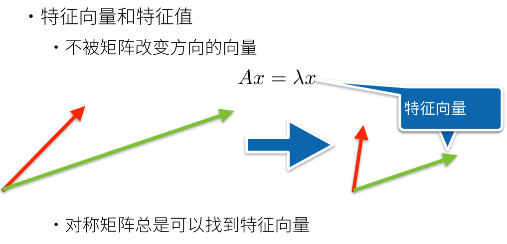

# d2l笔记

## 资源链接

*   系统学习pandas等数据处理方法 https://www.kaggle.com/learn
*   `Google colab`资源 https://colab.research.google.com
*   d2l中文版
    *   课程主页：https://courses.d2l.ai/zh-v2/
    *   视频讲解-B站李沐：https://space.bilibili.com/1567748478/channel/seriesdetail?sid=358497
    *   教材v2：https://zh.d2l.ai/index.html
    *   中文开源：https://github.com/d2l-ai/courses-zh-v2

*   英文版
    *   课程主页：https://courses.d2l.ai/berkeley-stat-157/index.html
        *   https://courses.d2l.ai/berkeley-stat-157/units/introduction.html

    *   视频讲解-伯克利：https://www.youtube.com/playlist?list=PLZSO_6-bSqHQHBCoGaObUljoXAyyqhpFW
    *   教材：https://d2l.ai/
    *   英文开源：
        *   https://github.com/d2l-ai/d2l-en
        *   https://github.com/d2l-ai/berkeley-stat-157


# 深度学习基础

## 引言

第一章从机器学习讲起，首先是机器学习各个方面的应用。然后明白了**机器学习=数据+模型**，模型进一步可以关注到其结构、量化有效性的目标函数、优化模型的算法。再继续对知识体系概览，一般机器学习要学的有监督学习（回归、分类、标注、搜索、推荐、序列学习等）、无监督学习、强化学习、离线学习等，这一分类是从数据使用角度出发的，而其他不同的角度自然有不同的分类。最后，引出了本门课程的主体——深度学习，为机器学习最重要最有效的部分。

## 知识结构

>   *   卷积：空间上的神经网络
>   *   循环：时间上的神经网络
>   *   注意力：逻辑上的神经网络
>   *   优化：高性能、算法方面的设计
>   *   应用：视觉和语言两大方面

*   深度学习基础：线性神经网络、多层感知机
*   卷积神经网络：`LeNet`、`AlexNet`、VGG、Inception、ResNet
*   计算机视觉：目标检测、语义分割
*   循环神经网络：RNN、GRU、LSTM、seq2seq
*   注意力机制：Attention、Transformer
*   自然语言处理：词嵌入、BERT
*   优化算法：SGD、Momentum、Adam
*   高性能计算：并行、多GPU、分布式

## 学习目标

*   深度学习里有哪些技术
*   如何实现和调参
*   背后的原因（直觉、数学）

## 深度学习介绍

*   AI地图

    *   x轴：不同的模式，即符号学、概率模型、机器学习
    *   y轴：问题领域（想做的东西），即感知、推理、知识、规划逐渐深入


*   深度学习落地到实际应用

    *   领域专家+数据科学家，AI专家

    *   数据科学家发展的两个序列，深度方向即为AI专家，广度方向则为工程师（狭义上的本身）


*   深度学习的有效性

    *   对模型的空间信息、时间信息、泛化性做出直觉等方面的描述
*   深度学习的可解释性
    *   哪些地方工作，哪些地方不能工作
    *   模型本身可被数学表述
    *   或许做不到数学公式哪些给出强弱不同的条件，但是可以划定或者证明出有些地方一定成立？弱化难度，此处联想阿贝尔定理


## 学习效果评价

| 水平                                        | 效果                             |
| :------------------------------------------ | :------------------------------- |
| level 1 看一本书                            | 转头就忘                         |
| level 2 听别人讲（视频课）                  | 印象深刻，但是内容是片段化的     |
| level 3 看书+听人讲                         | 眼睛和耳朵的调动，大脑记忆更深刻 |
| level 4 看书+听+动手做                      | 有了自己独立的东西               |
| level 5 看书+听+动手做+讲解表达出来（费曼） | 理解深，有了创造性的东西         |

## [环境配置](https://zhuanlan.zhihu.com/p/367740437)

### `CUDA cudnn`安装

*   https://pytorch.org/get-started/previous-versions/

```python
conda install cudatoolkit=10.2 # 若需指定版本
cudnn
```

### `pytorch+cuda`安装

*   `nvidia-smi`查看支持版本
*   https://pytorch.org/get-started/previous-versions/

```python
conda install pytorch==1.12.1 torchvision==0.13.1 torchaudio==0.12.1 cudatoolkit=10.2 -c pytorch
```

```python
print(torch.__version__)
print(torch.cuda.is_available())
print(torch.version.cuda)
```


## 练习

* 你当前正在编写的代码的哪些部分可以“学习”，即通过学习和自动确定代码中所做的设计选择来改进？你的代码是否包含启发式设计选择？

    >     启发式设计选择是在编程和系统设计中基于经验、直觉或一般原则做出的设计决策，往往来自：
    >
    >   1.  领域专家经验
    >   2.  实验验证
    >   3.  最佳实践积累
    >   4.  理论分析指导
    >
    >   答：比如编写的推荐系统代码，
    >
    >   可学习部分:
    >
    >   *   用户和物品的嵌入向量
    >   *   特征交互函数的参数
    >   *   排序模型权重
    >
    >   启发式设计:
    >
    >   *   负样本采样策略
    >   *   特征工程方法
    >   *   召回策略选择
    >
    >   再比如，计算机视觉代码，
    >
    >   可学习部分:
    >
    >   *   特征提取器的参数(如CNN中的卷积核权重)
    >   *   特征层级结构(网络架构搜索)
    >   *   数据增强策略的选择和参数
    >
    >   启发式设计:
    >
    >   *   网络层数、通道数的选择
    >   *   学习率调度策略
    >   *   批量大小选择

*   你遇到的哪些问题有许多解决它们的样本，但没有具体的自动化方法？这些可能是使用深度学习的主要候选者。

>   主要是各个领域的问题，比如检测城市地下管道，有大量图像；比如医疗领域的健康管理，数据比较隐私；比如交通红绿灯根据道路情况定制化，目前有城市在展开；比如快递车辆的选择性维修检测（设备故障预测）；用户感兴趣的行为预测等等
>

*   如果把人工智能的发展看作一场新的工业革命，那么算法和数据之间的关系是什么？它类似于蒸汽机和煤吗？根本区别是什么？

>   问题一：
>
>   *   **算法（蒸汽机）**：算法是人工智能的核心驱动力，如同蒸汽机是工业革命的核心技术。算法决定了如何处理数据、提取信息并做出决策。
>   *   **数据（煤）**：数据是算法的燃料，如同煤为蒸汽机提供能量。没有数据，算法无法学习和优化。
>   *   算法和数据相辅相成，数据是算法的基础，算法让数据发挥出巨大的力量。
>
>   问题二和三：
>
>   类似但不同——
>
>   *   **互动性**：算法和数据之间存在双向互动。算法依赖数据，但数据的选择和处理也受算法影响，而蒸汽机和煤的关系是单向的，煤只是能量来源。
>   *   **可复制性**：数据可以无限复制和共享，而煤是有限的物理资源，消耗后不可再生。
>
>   *   **动态性**：数据和算法不断进化，数据可以实时更新，算法也能持续优化，而蒸汽机和煤的技术进步相对缓慢。
>
>   *   **多样性**：数据来源多样，涵盖文本、图像、音频等，而煤作为能源形式单一。

* 你还可以在哪里应用端到端的训练方法，比如 [图1.1.2](https://zh-v2.d2l.ai/chapter_introduction/index.html#fig-ml-loop) 、物理、工程和计量经济学？


>   *   **机器人**：从传感器数据直接输出控制指令
>
>   *   **游戏的NPC设计**：从游戏状态直接输出动作策略
>
>   *   **材料属性预测**：从材料结构数据直接预测其物理和化学属性。
>
>   *   **天体图像分析**：从天文图像直接识别天体类型和特征。
>
>   *   **自动驾驶**：
>
>       *   **环境感知**：从传感器数据直接输出车辆周围环境信息。
>       *   **路径规划**：从环境数据直接输出最优行驶路径。
>
>   *   **能源管理**：
>
>       *   **电力负荷预测**：从历史数据直接预测未来电力需求。
>       *   **智能电网优化**：从电网数据直接输出优化调度方案。
>
>   *   **政策效果评估**：从社会经济数据直接评估政策实施效果。
>
>   *   **信用评分**：从客户数据直接评估信用风险。
>
>   *   **市场风险预测**：从市场数据直接预测风险事件。
>
>   *   **诊断辅助系统**：
>
>       *   **综合诊断**：从患者的多模态数据（如影像、实验室结果、病史）直接生成诊断建议。
>       *   **预后预测**：从患者数据直接预测疾病进展和治疗效果。
>
>   *   **健康监测**：从可穿戴设备数据监测患者健康状况，如心率、血压等。
>
>   *   **医学文献知识发现**：从大量医学文献中直接提取有用的知识和关联。
>
>   *   **作物监测与管理**：
>
>       *   **作物健康监测**：从无人机或卫星图像直接检测作物健康状况，识别病虫害、营养不良等问题。
>       *   **生长预测**：从环境数据和作物图像直接预测作物生长周期和产量。
>
>   *   **自动化农业机械**
>
>       *   路径规划：从田间地图和传感器数据直接生成最优作业路径。
>       *   作业控制：从实时传感器数据直接控制拖拉机进行播种、施肥、喷药等作业。
>
>       *   作物识别与收割：从摄像头和传感器数据直接识别成熟作物并进行自动化收割。
>
>   等等，难点有时候往往在技术之外。


# 数据基础

## 数据操作

### 查阅文档

>   学会查看pytorch API

*   `dir`：查找模块中所有函数和类，通常可以忽略以`__`（双下划线）开始和结束的函数和以`_`（单下划线）开始的函数，是Python特殊对象或内部函数
*   `help`：查找特定的函数和类的用法
*   `vscode`编辑器能自动弹出常用函数类及其说明
*   `jupyter`中可以使用`?`指令显示文档，使用`??`指令显示实现该函数的代码

### N维数组

*   概念理解，N维数组
    
    
    
    
    *   矩阵，数字的运算，CPU计算，numpy库
    
        张量，信息的空间，遵循一套相应的变换规则；支持GPU加速、自动微分，更适合深度学习

    *   [关于tensor（张量）的介绍和理解](https://blog.csdn.net/weixin_43860947/article/details/127950079)
    
    *   [张量和矩阵的区别](https://medium.com/@quantumsteinke/whats-the-difference-between-a-matrix-and-a-tensor-4505fbdc576c)
    
*   创建张量/数组：用排列、用指定分布、赋Python列表
    

*   访问张量元素及其形状、大小
    

### 动手实践：张量基础

#### 张量基本操作

*   用arange创建一个张量：x = torch.arange(12)
*   通过shape属性访问张量形状：x.shape
*   张量的大小 x.numel()
*   要改变一个张量的形状而不改变元素数量和元素值，可以调用 reshape 函数 
    x = x.reshape(3, 4)
    *   x.size()、x.shape

*   常用创建张量的方法(使用全0、全1、其他常量或者从特定分布中随机采样的数字) 
    *   torch.zeros((2, 3, 4))
    *   torch.ones((2, 3, 4, 5))
    *   torch.randn(3, 4)

*   给张量赋值(提供Python列表等) 
    torch.tensor([[2,1,4,3], [1, 2, 3, 4], [4, 3, 2, 1]])

#### 数学运算

*   加减乘除求幂等
*   连结多个张量
    *   指定沿那个轴连结
    *   默认按照dim=0合并
*   逻辑运算创建二元张量（同型矩阵）

#### 广播机制

*   两个张量形状相同时，正常数学运算
*   两个张量形状不同时，调用广播机制（broadcasting mechanism）执行按元素操作
    *   第一步，扩展数组，转换成相同形状
    *   第二步，执行按元素操作

#### 索引和切片

#### 节省内存

*   问题：运行一些操作可能会导致为新结果分配内存
    *   应对方案：执行原地操作等

#### 张量转化为其他Python对象

*   如numpy对象、内置数据类型

### 练习2.1

1.  运行本节中的代码。将本节中的条件语句`X == Y`更改为`X < Y`或`X > Y`，然后看看你可以得到什么样的张量。

    *   返回与X和Y大小相同的张量，内容根据判断条件为True或False

    ```python
    import torch
    import os
    import numpy as np
    import matplotlib.pyplot as plt
    from torch.distributions import multinomial
    from d2l import torch as d2l
    
    X = torch.arange(12, dtype=torch.float32).reshape((3,4))
    Y = torch.tensor([[2.0, 1, 4, 3], [1, 2, 3, 4], [4, 3, 2, 1]])
    ```

    ```python
    X < Y
    tensor([[ True, False,  True, False],
            [False, False, False, False],
            [False, False, False, False]])
    ```

    ```python
    X > Y
    tensor([[False, False, False, False],
            [ True,  True,  True,  True],
            [ True,  True,  True,  True]])
    ```

    

2.  用其他形状（例如三维张量）替换广播机制中按元素操作的两个张量。结果是否与预期相同？

```python

```


## 数据预处理

### 基本流程

*   数据集的读取

    *   `.csv`、`.svg`病理图片、.xml医生勾画的区域格式等原始数据
    *   常用库：os、pandas

*   处理缺失值

    *   机器学习本质就是处理缺失值

    *   低级处理是填补缺失的数据，采用插值法和删除法

        >   `pd.read_csv`
        >
        >   `.fillna`
        >
        >   `pd.get_dummies`

    *   高级处理是预测不存在的数据达到期望

*   经过上述步骤，所有条目都是数值类型，它们可以转换为tensor格式

### 动手实践：数据预处理


### 练习2.2


## 线性代数基础


### 标量、向量、矩阵

>   向量是标量的推广，矩阵是向量的推广，进而能有更广泛的推广，在深度学习中抽象为张量

*   标量：基本操作（加减乘除、映射）、长度
    

*   向量：标量值组成的列表，基本运算、点乘、正交、长度等
    

    

    

*   矩阵
    

    *   特殊矩阵：转置（transpose）、对称和反对称矩阵、正定矩阵、正交矩阵、置换矩阵

        

    *   特征值和特征向量
        

### 动手实践：张量的运算

#### reshape、clone、按元素乘法

*   加法、clone
*   按元素乘法——Hadamard积、数乘
*   ` A\*B 点积时用；torch.mm 矩阵乘法时用` 
*   `torch.Tensor`的4种乘法 https://blog.csdn.net/da_kao_la/article/details/87484403
*   从Python 3.5开始，可以使用@运算符来实现矩阵乘法。这个特性是通过PEP 465提案添加到Python中的，它允许使用@作为矩阵乘法（也称为点积或叉乘）的运算符；在NumPy中，这个特殊方法是dot方法；在PyTorch中，这个特殊方法是mm或matmul方法

#### 求和与降维

*   默认按所有轴降维，得到一个标量

*   可以一个或多个指定axis

*   进而可计算平均值等，可用sum/shape或者mean

*   非降维求和：保持轴数不变，`keepdims=True`、通过广播将A除以sum_A

*   调用`cumsum`计算累积和

#### 点积

*   相同位置按元素乘积的和

#### 矩阵-向量积

*   A的列维数必须与x的维数相同

*   矩阵乘法的基础，分块思想

*   从向量转换的角度理解：把一个矩阵乘法的过程看作是向量转换

#### 矩阵-矩阵乘法

*   简称矩阵乘法

*   最重要的是理解矩阵的分块：可以将矩阵-矩阵乘法AB看作是简单地执行m次矩阵-向量积，并将结果拼接在一起，形成一个n×m矩阵

#### 范数

*   矩阵范数，满足三个性质

*   L1范数：向量元素的绝对值之和

*   L2范数：向量元素平方和的平方根

*   `Frobenius`范数：矩阵元素平方和的平方根

### 练习2.3

## 微积分

### 导数和微分

*   标量导数：导数是切线的斜率

    

*   亚导数：将导数拓展到不可微的函数

    


### 梯度

将导数拓展到向量

>   深度学习重点关注标量函数的求导，非标量变量往往会通过sum转换为标量的自动微分


*   标量-向量

    

    

*   向量-标量：$\frac{\partial y}{\partial \mathbf{x}}$是行向量，称为分子布局符号；$\frac{\partial \mathbf{y}}{\partial x}$是列向量，称为分母布局符号

    

*   向量-向量
    


*   矩阵计算：将导数拓展到矩阵

    

### 进阶

*   矩阵求导的本质与分子布局、分母布局的本质（矩阵求导——本质篇） - 普通用户的文章 - 知乎
    https://zhuanlan.zhihu.com/p/263777564
    *   矩阵求导公式的数学推导（矩阵求导——基础篇） - 普通用户的文章 - 知乎
        https://zhuanlan.zhihu.com/p/273729929
    *   矩阵求导公式的数学推导（矩阵求导——进阶篇） - 普通用户的文章 - 知乎
        https://zhuanlan.zhihu.com/p/288541909
    *   对称矩阵的求导，以多元正态分布的极大似然估计为例（矩阵求导——补充篇） - 普通用户的文章 - 知乎
        https://zhuanlan.zhihu.com/p/305171795
*   矩阵F范数求导？ - 知乎
    https://www.zhihu.com/question/43308836/answer/96679966
*   The Matrix Calculus You Need For Deep Learning https://arxiv.org/abs/1802.01528
*   **矩阵求导术（上） - 长躯鬼侠的文章 - 知乎**
    https://zhuanlan.zhihu.com/p/24709748
    *   矩阵求导术（下） - 长躯鬼侠的文章 - 知乎
        https://zhuanlan.zhihu.com/p/24863977
*   https://immersivemath.com/ila/tableofcontents.html
*   机器学习中的数学理论1：三步搞定矩阵求导 - 科技猛兽的文章 - 知乎
    https://zhuanlan.zhihu.com/p/262751195
    *   机器学习中的数学理论2：近端梯度下降 - 科技猛兽的文章 - 知乎
        https://zhuanlan.zhihu.com/p/277041051
*   [刘建平Pinard](https://www.cnblogs.com/pinard)  https://www.cnblogs.com/pinard/p/10750718.html
*   https://www.matrixcalculus.org/
*   学习机器学习，遇到关于矩阵（矩阵求导、矩阵范数求平方之类）的公式看不懂，怎样补足数学基础？ - 知乎
    https://www.zhihu.com/question/338548610
*   The Matrix Calculus You Need For Deep Learning https://arxiv.org/pdf/1802.01528
    *   https://explained.ai/matrix-calculus/index.html

### 链式法则

*   标量链式法则

    

*   拓展到向量

    

### 自动微分

>   =自动求导，计算一个函数在指定值上的导数，automatic differentiation
>
>   与符号求导、数值求导区别开来

#### 计算图 computational graph

*   将代码分解成操作子
*   将计算表示成一个无环图
*   显式（`Tensorflow/MXNet`）或隐式构造（`PyTorch/MXNet`）


#### 自动求导的两种模式

>   链式法则的两种不同拆分角度

*   正向累积

    

*   反向累积，反向传递 backpropagate

    

*   自动求导实现

    *   思考torch默认累积梯度这一设计的好处与牺牲

    

    *   复杂度分析

        


#### 非标量变量的反向传播

*   深度学习中 ，我们的目的不是计算微分矩阵，而是批量中每个样本单独计算的偏导数之和
*   关键点最后是标量函数的求导，非标量变量往往会通过sum转换为标量的自动微分（深刻体会sum与降维）

#### 分离计算

*   通过detach将某些计算移动到记录的计算图之外（让梯度不流经某条路）

#### Python控制流的梯度计算

*   深度学习框架自动计算导数：
    *   首先将梯度附加到想要对其计算偏导数的变量上
    *   然后记录目标值的计算（可选择分离某些计算），执行其反向传播函数
    *   可访问得到的梯度

### 练习2.4

### 练习2.5

## 概率


### 练习2.6


# 线性模型与多层感知机

## 线性模型

*   整体认识

    *   数学上是输入特征的一个仿射变换
    *   对n维输入的加权，外加偏差

*   通常与预测有关，`e.g.`房价

*   相关术语

    *   训练数据集/训练集
    *   样本/数据点/数据样本
    *   标签/目标
    *   特征/协变量

*   数学模型

    *   单个数据样本，特征
    *   数据集，特征集合

    

*   损失函数（衡量预估质量）、训练数据、参数学习

    *   平方损失

    *   原理：噪声分布假设是正态分布（高斯噪声），通过最大似然估计得出估计量。此时，最小化均方误差等价于对线性模型的极大似然估计

    *   参数学习

        

*   关于问题的解

    *   解析解线性回归有，但一般深度学习没有也不需要（对问题的限制很严格）

        

*   随机梯度下降

    

    *   通过不断沿着反梯度方向更新参数求解

    *   深度学习的基本（默认）优化方法：小批量随机梯度下降，minibatch stochastic gradient descent

    *   两个重要的超参数是批量大小和学习率（自己动手实现时，批量大小要么给梯度，要么给学习率除）

        

        

*   泛化：找到一组参数，使得模型在从未见过的数据集上实现较低的损失

*   从线性回归到深度网络

    *   线性模型可以看作是单层神经网络
    *   神经网络图描述，全连接层/稠密层
    *   神经网络源于神经科学，高于生物学，更多灵感来自数学、统计学、计算机科学

*   典型实现过程

    *   数据集制作、加载数据集
    *   定义神经网络架构
        *   初始化参数
        *   定义模型
        *   指定损失函数
        *   定义优化算法
    *   训练、评估模型

*   代码实现细节

    *   使用矢量化加速
    *   定义一个Timer类对比for循环和使用矢量化加速的线性代数库之间的区别
    *   torch为什么要累积梯度？

## `Softmax`回归

*   回归 vs 分类

    *   回归估计一个连续值，分类预测一类离散类别
    *   分类理解上的细节：“硬性”，属于哪个类别，“软性”，属于每个类别的概率，即使是硬类别，也仍然使用软类别的模型

*   从回归到多类分类

    *   

    *   分类问题的编码：独热编码（one-hot encoding）

    *   网络架构

        *   无校验比例

        *   校验比例：`softmax`操作子

            

    *   对应交叉熵损失

        

    *   常用处理技巧：`LogSumExp`数值稳定性处理，`Softlabel`训练策略

*   损失函数+似然函数+梯度下降的数学分析

    *   L2 Loss

        

    *   L1 Loss

        

    *   Huber‘s Robust Loss

        

## 多层感知机

*   感知机

    *   

    *   训练感知机

        

    *   收敛定理

        

    *   XOR问题：第一次AI寒冬

        

*   多层感知机

    *   学习XOR

    *   激活函数

        >   本质上机器学习就是在做压缩（网络结构角度）
    
        *   Sigmoid函数

        *   Tanh激活函数

            

        *   ReLU函数

            

    *   通用近似定理：通过隐藏神经元，捕捉到输入之间复杂的相互作用
    
    *   单隐藏层-单分类
    
    *   隐藏层-多分类
    
        *   超参数：隐藏层数、每层隐藏层的大小
    
        

# 模型设计与实现

## 基本的模型选择方法

*   训练误差和泛化误差

*   数据集

    *   训练数据集：训练模型参数
    *   验证数据集：选择模型超参数
    *   关于验证集和测试集：实际使用中，往往没有测试，验证集扮演测试机的功能，这是因为数据不够

*   非大数据集上通常使用k-折交叉验证

    

## 模型容量与数据复杂度

*   欠拟合、过拟合


*   **模型容量**：拟合函数的能力

    

*   低容量的模型难以拟合训练数据，高容量的模型可以记住所有训练数据

    

    图中对应的是不同的模型，不是一个模型的连续变化

*   估计模型容量

    *   特点：难以在不同的种类算法之间比较，比如决策树模型和神经网络
    *   而给定模型的种类，考虑两个主要因素：**参数的个数、参数值的选择范围**

*   模型容量相关理论（了解）

    *   VC维：一个模型能记住一个数据集最大长什么样子
    *   线性分类器的VC维
    *   VC维的用处
        *   提供为什么一个模型好的理论依据——可以衡量训练误差和泛化误差之间的间隔
        *   但深度学习很少使用——衡量不准、计算深度学习模型的VC维很困难

*   数据复杂度（多个重要因素）

    *   样本个数
    *   每个样本的元素个数
    *   时间、空间结构
    *   多样性

*   总结

    *   模型容量需要匹配数据复杂度，否则可能导致欠拟合和过拟合
    *   统计机器学习提供数学工具来衡量模型复杂度
    *   实际中一般靠观察训练误差和验证误差

*   往深处学，李沐老师**直播问答**，很启发！

    *   神经网络本质是MLP
    *   数据清洗、设计超参等等
    *   从艺术到工程、科学

## 模型调优

>   模型调优切入点：输入、模型层、输出，每一块都有不同的方法。这里主要是通过施加噪声训练模型的稳定性以实现模型调优

### 正则化技术

*   weight decay 权重衰退

    *   原理是通过合理化参数范围来控制模型容量

    *   硬性限制

        

    *   柔性限制

        

    *   最优解的影响

        *   对于L2正则化，是一个二次函数，距离最优点越远，导数梯度越大，罚越大，反之在最优点附近趋于稳定

        

    *   参数更新法则

        $\lambda$通常可取1e-3、1e-4、1e-2

        

*   dropout 丢弃法

    *   动机：一个好的模型需要对输入数据的扰动保持抵抗力稳定性（大模型的“抵抗力稳定性和恢复力稳定性”）

        *   使用有噪音的数据等价于Tikhonov正则
        *   丢弃法：在层之间加入噪音

    *   只在训练时加噪

        *   方法 常取0.5、0.9、0.1

        

        *   作用位置

        

    *   推理时：

        

    *   较大的隐藏层+dropout>小的隐藏吃，无dropout


### 模型初始化

*   数值稳定性：多个矩阵乘法导致

    

    *   计算图可分析神经网络，常见问题是梯度消失（vanishing）和梯度爆炸（exploding）

    *   梯度爆炸（exploding）

        

    *   梯度消失（vanishing）

        

*   让训练更加稳定（此处从权重和激活函数方面下手）

    *   

    *   让每层的方差是一个常数：将每层的输出和梯度都看做随机变量，让它们的均值和方差都保持一致

        

        *   权重初始化——Xavier初始化 

            

        *   激活函数调整选用：（凑出$f(x)=x$）

            


## 实战：kaggle房价预测

*   集成学习，automl

*   随机森林

*   特征预处理和超参数是取得好成绩的基础

*   数据的一些难点
    *   数值较大
    *   有文本特征(地址，介绍)
    *   训练数据是前6个月，公榜是后3月，私榜是再后三个月

*   想要越来越做好，需要付出10倍20倍的功夫
    *   

*   https://www.kaggle.com/competitions/california-house-prices/discussion/240341?rvi=1

*   简单说下思路吧。我自己看房屋价格都是附近房子的价格、周边配套、出售时间、面积等等因素。

    *   附近价格采用zip的价格中位数
    *   周边配套只有学校分数和距离
    *   出售时间很奇怪，数据没有提供，只知道都是2020-2021，不过可以预估出来
    *   面积方面每平价格是个比较常用的指标

    再说说我发现的一些有趣的内容

    *   邮编理论上应该用分类编码，但用顺序编码效果会更好，我猜是因为越高的邮编代表的地区越新，而老城区价格一般都比较高
    *   **summary中有数据泄露**，大概可以提升0.01的效果，能比automl分数好就是这个原因。大概10%的数据中包含了sold price与卖出月份，从日期可以看出数据是按卖出时间排序的。至于为什么会有这个情况，是因为数据是从房屋中介网站zillow上爬来的，summary在卖出后又更新了
    *   当listed price和sold price偏离很大的时候，一般是因为数据真的出错或者listed price太过久远。前者只能删掉数据，后者可以按邮编算出地区年平均涨幅，会有一些作用

## 深度学习计算

*   层和块
    *   层：接受一组输入，生成相应的输出，由一组可调整参数描述，一个单层本身也可以是模型
    *   块：层组，由多个层组成的组件或者整个模型本身，计算机中的抽象，使得处理现实问题更加方便容易
    *   实现：用类，有自定义块、顺序块、嵌套块，Sequential类、nn.Module模组
*   参数管理
    *   访问参数，用于调试、诊断、可视化
        *   用.state_dict、.bias.data、.weight.data
        *   用列表收集和解包
        *   可嵌套收集参数

    *   参数初始化
        *   有内置初始化和自定义初始化，一个技巧：用布尔矩阵做乘法取一个矩阵的值，效率方便更快
        *   在不同模型间共享参数，设置一个层用于共享

*   自定义层
    *   We can design custom layers via the basic layer class. This allows us to define flexible new layers that behave differently from any existing layers in the library. 
    *   Once defined, custom layers can be invoked in arbitrary contexts and architectures. 
    *   Layers can have local parameters, which can be created through built-in functions.

*   读写文件
    *   加载和保存张量、加载和保存模型参数
    *   The save and load functions can be used to perform file I/O for tensor objects.
    *   We cansave and load the entire sets of parameters for a network via a parameter dictionary. 
    *   Saving the architecture has to be done in code rather than in parameters.

*   GPU
    *   获取计算设备的函数
    *   考虑GPU上计算能否更快，有时候不如在CPU计算（搬运数据的额外开销）
    *   神经网络与GPU，将数据移动到GPU上计算
    *   We can specify devices for storage and calculation, such as the CPU or GPU. By default,
        data is created in the main memory and then uses the CPU for calculations. 
    *   The deep learning framework requires all input data for calculation to be **on the same device**, be it CPU or the same GPU. 
    *   You can lose significant performance by moving data without care. **A typical mistake** is as follows: computing the loss for every minibatch on the GPU and reporting it back to the user on the command line (or logging it in a NumPy ndarray) will trigger a global interpreter lock which stalls all GPUs. It is **much better** to allocate memory for logging **inside the GPU** and only move larger logs.
    *   课堂答疑：数据是关键，模型相对差不多就ok


# 卷积神经网络

## 卷积基础

*   从全连接层到卷积
*   图像卷积
*   填充和步幅
    *   
    *   

*   多输入多输出通道
*   池化层

## 经典卷积神经网络模型

### `LeNet`

### `AlexNet`

### VGG

### Inception

### ResNet

## 计算机视觉实践


# 循环神经网络

## 序列模型、语言模型

*   序列数据与序列模型
    *   随机变量之间不独立，有一定依赖关系
    *   最纯粹的关系式过于复杂，无法求解
    *   我们需要建模，
        *   用隐马尔可夫模型做推理，一个俄罗斯的数学家
        *   潜变量>隐变量

    *   

*   语言模型

    *   n元语法，基于马尔可夫假设建模

        

    *   
    
    *   tokenizer ：https://cloud.tencent.com/developer/article/1865689

        >   把输入的文本流，切分成一个个子串，每个子串相对有完整的语义，便于学习embedding表达和后续模型的使用
        >
        >   最常用的三种tokenize算法：BPE（Byte-Pair Encoding），WordPiece和SentencePiece
    
    *   数据采样策略：随机采样和顺序分区策略
    
        

## RNN、GRU、LSTM

*   循环神经网络

    *   潜变量回归模型

    *   循环神经网络

        *   

        *   相比MLP，$W_{hh}$存储了时序信息

            

    *   衡量指标：困惑度perplexity

        *   用的是平均交叉熵，进一步取指数，是为了让变化看上去更显著

    *   迭代过程中数值稳定性的处理：梯度裁剪

        

    *   RNN应用整体认识

        

        

*   GRU 门控循环单元

*   LSTM 长短期记忆网络

## 深层、双向RNN

## 编码器-解码器、seq2seq、束搜索


# 注意力机制

## 注意力提示


### 练习10.1

*   在机器翻译中通过解码序列词元时，其自主性提示可能是什么？非自主性提示和感官输入又是什么？

在机器翻译中，**解码器生成目标语言词元时**，其行为受到多种类型的提示（cues）驱动。这些提示可以分为三类：**自主性提示（Autonomous Cues）**、**非自主性提示（Non-Autonomous Cues）** 和 **感官输入（Sensory Input）**。以下是它们的定义、作用及实际示例：

------

**1. 自主性提示（Autonomous Cues）**

**定义**：解码器在生成目标词元时，**主动依赖的、与源语言无关的内部知识或规则**。这些提示来源于模型对目标语言本身的先验学习（如语法、语义、常见表达），而非直接依赖源语言输入。

**特点**：

*   **目标语言主导**：确保生成结果符合目标语言的语法和表达习惯。
*   **独立性**：即使脱离源语言输入，解码器仍能生成合理的句子（类似语言模型）。

**具体表现**：

*   **语言模型能力**：解码器基于目标语言的统计规律生成流畅的词序列（如选择更常见的搭配）。
*   **自注意力机制**：在Transformer中，解码器通过自注意力关注已生成的目标词序列，维持上下文一致性。
*   **目标端先验知识**：例如，在翻译为英语时，自动遵循英语的“主谓宾”结构。

**示例**：
当翻译“她去了巴黎”为英语时，解码器可能基于目标语言知识选择“She went to Paris”而非直译的“She go to Paris”，即使源语言动词时态不明显。

------

**2. 非自主性提示（Non-Autonomous Cues）**

**定义**：解码器在生成目标词元时，**被动依赖的、与源语言直接相关的约束信息**。这些提示强制解码器忠实于源语言内容，避免自由发挥。

**特点**：

*   **源语言驱动**：确保翻译结果与源语言语义对齐。
*   **任务依赖性**：翻译任务的核心要求是准确传递源语言信息。

**具体表现**：

*   **编码器输出**：解码器通过注意力机制（如Transformer的交叉注意力）访问源语言句子的编码表示。
*   **对齐约束**：显式或隐式的词对齐、短语对齐（如统计机器翻译中的对齐表，或神经模型中的注意力权重）。
*   **强制复制机制**：处理未登录词（OOV）时直接复制源语言词（如人名、地名）。

**示例**：
翻译“ChatGPT是一种AI模型”为英文时，解码器必须依赖源语言信息，确保“ChatGPT”被保留而非替换为其他名称。

------

**3. 感官输入（Sensory Input）**

**定义**：解码器接收的**原始或预处理后的源语言数据表示**，是翻译过程的起点和基础输入。

**特点**：

*   **低层次特征**：通常为词、子词（如BPE）或字符的嵌入表示。
*   **预处理依赖**：需通过编码器（如LSTM、Transformer）转换为高层语义表示。

**具体形式**：

*   **词嵌入（Word Embeddings）**：源语言词的向量表示（如Word2Vec、BERT）。
*   **位置编码（Positional Encoding）**：在Transformer中标记词的位置信息。
*   **子词信息**：如BPE（Byte-Pair Encoding）分割后的片段（如“un+fortunately”）。

**示例**：
源句子“你好，世界！”被转换为词嵌入序列 `[emb(你), emb(好), emb(，), emb(世界), emb(！)]`，作为编码器的输入。

------

**三者的协作关系**

1.  **感官输入**是翻译的起点，编码器将其转换为高层语义表示（如上下文向量）。
2.  **非自主性提示**将编码后的源语言信息传递给解码器，确保翻译忠实性。
3.  **自主性提示**基于目标语言知识调整生成结果，确保流畅性和自然性。

**实际模型中的体现**（以Transformer为例）：

*   **感官输入**：源语言词嵌入 + 位置编码 → 编码器的输入。
*   **非自主性提示**：编码器输出的Key-Value对 → 解码器通过交叉注意力访问。
*   **自主性提示**：解码器的自注意力层 + 目标语言词嵌入 → 生成连贯的目标序列。

------

**总结**

*   **自主性提示**：解码器的“内在语言能力”，确保目标语言的自然性（如语法、搭配）。
*   **非自主性提示**：解码器的“外部约束”，确保翻译忠实于源语言内容（如注意力机制）。
*   **感官输入**：翻译的“原材料”，即源语言的低层次表示（如词嵌入）。

这三者的动态平衡决定了机器翻译的质量：

*   **过度依赖自主性提示** → 翻译不忠实（如漏译、意译过度）。
*   **过度依赖非自主性提示** → 翻译生硬（如逐词直译、语序错误）。
*   **感官输入质量差**（如分词错误、嵌入不佳） → 整体翻译失败

在机器翻译解码词元时的提示类型可以这样理解：

自主性提示:

*   语言模型根据已生成的上文内容自主预测下一个词元
*   基于训练数据学到的语言规律和语法结构进行推理
*   根据上下文语境自动调整输出方向

非自主性提示:

*   来自源语言输入的强制性约束和对齐信息
*   预定义的翻译规则和模板的限制
*   人工设定的词典映射关系

感官输入:

*   源语言文本序列本身
*   词频、共现等统计特征信息
*   句法分析树等语言学特征


## 注意力汇聚

## 注意力评分函数

## Bahdanau注意力

## 多头注意力

## 自注意力和位置编码

## Transformer


## 自然语言处理：预训练

*   Bert

## 自然语言处理：应用

*   情感分析


# 优化和计算

## 优化算法

*   SGD
*   Momentum
*   Adam

## 计算性能

*   并行
*   多GPU
*   分布式

