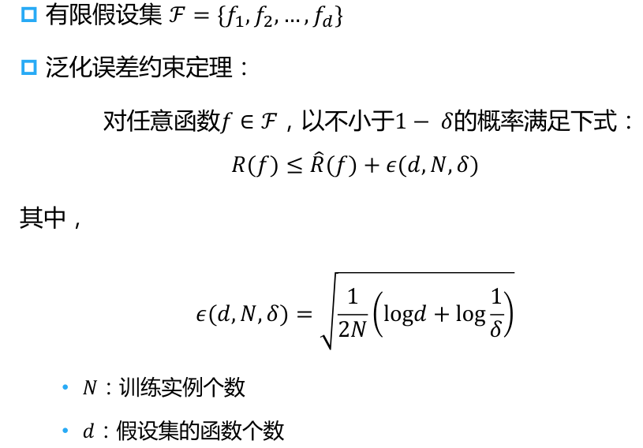
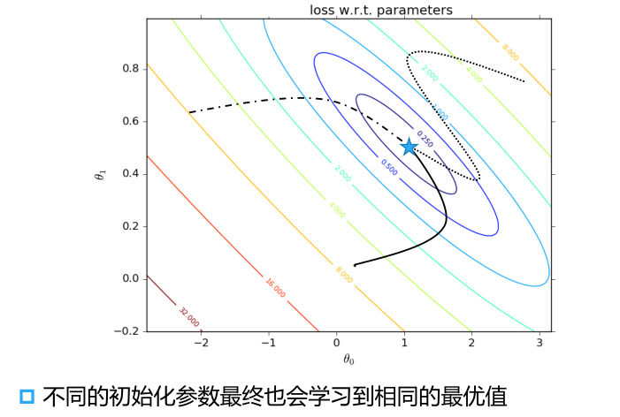
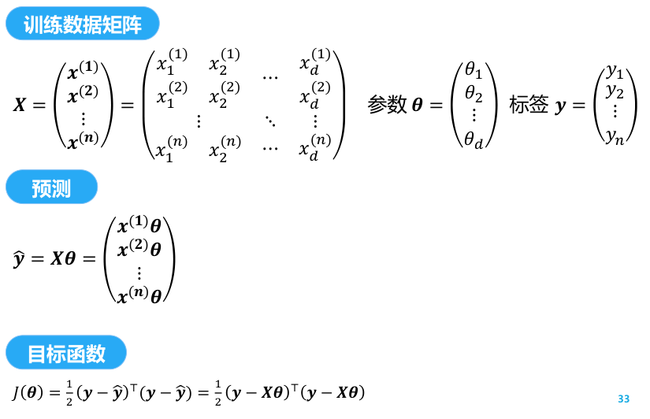
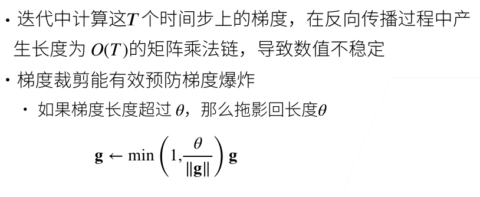

# AI基础笔记

# 整体认识

数据分析与处理、机器学习、深度学习、推理部署


# 数据分析与实践

*   csdiy


## 资源列表

>   本课程主要从数据科学基础，数据统计，数据挖掘，机器学习等方面入手，较全面地描述了数据分析的全过程。这是一门实践导向的课程，它的主要编程工具为Python，内容包括python的基础语法与应用（自学然后完成实验），如何获取数据（爬虫），如何在原始数据之上进行特征工程，统计分析，可视化实验，如何使用机器学习基础算法。课程的最后还会给出一项情景任务，之前三年给过的任务是根据某场LOL比赛的场上数据预测比赛胜率、根据某国家学生的各项能力得分预测其数学成绩和根据PISA提供的学生各项基本情况（比如：家庭收入、学校是否有音乐课等）数据来预测学生是否复读。本课程没有期末考试，平时的每项实验都很重要，课程中后期还会有一项调研报告任务，其会培养同学们查找资料、阅读论文、书写报告的能力。
>
>   作为一项实践性的课程，同学们可以提前熟悉Python的使用（尤其是网络爬虫），jupyter的使用，调研报告的书写技能（可以使用Typora；老师明确表示希望看到更加美观的报告，可以提前学习latex来尝试美化自己的报告），课程中会涉及一系列机器学习基础算法，由于课程内容比较多，某些算法可能不会细讲，且作为导论课程课程深度不会过于深，有兴趣的同学可以去B站看看吴恩达的机器学习/深度学习网课作为补充。另外，基本上每节课都有当堂小测，就算一筹莫展也尽量写上姓名学号交上去。

>   课程内容：
>
>   *   每节课都点名，形式为小测，算入总评。小测的时间较为随机，题目稍微有点难度，可能需要听课才能做出来；
>   *   共计五次实验，每次实验给的时间都不长，约半个月；
>   *   一篇文献调研，ddl和最后一次实验挤在一起。
>
>   实验内容：
>
>   *   Python入门级难度的编程练习，OJ平台，（第一次实验不需要写实验报告，之后的实验均需要报告）；
>   *   一个简单的网页爬虫，从三个任务中选一个：王者荣耀，豆瓣，评课社区；
>   *   数据分析：[参考模板](https://www.kaggle.com/code/startupsci/titanic-data-science-solutions/notebook)，[数据集](https://www.oecd.org/pisa/publications/pisa-2018-results.htm)的一个子集；
>   *   关联规则发掘，数据集同上；
>   *   特征预测，数据集同上。
>
>   总评给分：
>
>   *   本人的总评分数不是很理想，至少个人认为对不上自己的付出。
>   *   助教表示优秀率给满，且最后一节课有优秀作业展示，从结果看是没啥问题。但不公布具体成绩明细，实验提交之后不再有回复。
>   *   个人推测是课堂小测缺席一次就总评扣几分，那我确实该寄。不过已经修够所有学分了，便没有再纠结赋分。
>
>   你可能感兴趣的内容：
>
>   [完美的数据分析JupyterNotebook模板](https://www.kaggle.com/code/ldfreeman3/a-data-science-framework-to-achieve-99-accuracy#Step-4:-Perform-Exploratory-Analysis-with-Statistics)
>
>   [关联规则python实现](https://github.com/blackAndrechen/data_mine)
>
>   神经网络算法python实现：https://github.com/ankonzoid/NN-scratch)

*   系统学习pandas等数据处理方法 https://www.kaggle.com/learn
*   `Google colab`资源 https://colab.research.google.com
*   数据科学导论 ustc http://staff.ustc.edu.cn/~huangzhy/Course/DS2024.html
*   上交张伟楠 https://wnzhang.net/teaching/ee448/index.html
*   **UCB Data100: Principles and Techniques of Data Science https://csdiy.wiki/%E6%95%B0%E6%8D%AE%E7%A7%91%E5%AD%A6/Data100/**
*   求台大林轩田的learning from data (yaser)这本书后面的problem的答案？ - Doraemonzzz的回答 - 知乎
    https://www.zhihu.com/question/49039226/answer/427112075

## 数据科学基础


## 数据分析基础

### 数据采集 Data Collection

信息检索，网络爬虫

### 数据存储 Data Storage

### 数据预处理Data Preprocessing

数据清洗

数据集成

数据变换

数据规约


一个典型的数据预处理流程

*   数据集的读取

    *   `.csv`、`.svg`病理图片、.xml医生勾画的区域格式等原始数据
    *   常用库：os、pandas

*   处理缺失值

    *   机器学习本质就是处理缺失值

    *   低级处理是填补缺失的数据，采用插值法和删除法

        >   `pd.read_csv`
        >
        >   `.fillna`
        >
        >   `pd.get_dummies`

    *   高级处理是预测不存在的数据达到期望

*   经过上述步骤，所有条目都是数值类型，它们可以转换为tensor格式


### 特征工程 Feature Engineering

特征设计

特征选择

特征理解


## 专题：Python编程基础


### 查阅pytorch API

*   `dir`：查找模块中所有函数和类，通常可以忽略以`__`（双下划线）开始和结束的函数和以`_`（单下划线）开始的函数，是Python特殊对象或内部函数
*   `help`：查找特定的函数和类的用法
*   `vscode`编辑器能自动弹出常用函数类及其说明
*   `jupyter`中可以使用`?`指令显示文档，使用`??`指令显示实现该函数的代码

### 张量

#### 认识张量

*   概念理解，N维数组

    *   [关于tensor（张量）的介绍和理解](https://blog.csdn.net/weixin_43860947/article/details/127950079)

    *   [张量和矩阵的区别](https://medium.com/@quantumsteinke/whats-the-difference-between-a-matrix-and-a-tensor-4505fbdc576c)

        >   矩阵，数字的运算
        >
        >   张量，信息的空间，秩为阶数，关键点是遵循一套相应的变换规则

    

    

*   创建张量/数组：用排列、用指定分布、赋Python列表

*   访问张量元素及其形状、大小

#### 张量的数学运算

*   加减乘除求幂等
*   连结多个张量
    *   指定沿那个轴连结
    *   默认按照dim=0合并
*   逻辑运算创建二元张量（同型矩阵）

#### 张量的广播机制

*   两个张量形状相同时，正常数学运算
*   两个张量形状不同时，调用广播机制（broadcasting mechanism）执行按元素操作
    *   第一步，扩展数组，转换成相同形状
    *   第二步，执行按元素操作

#### 张量的索引和切片

#### 张量的其他内容

*   节省内存
    *   问题：运行一些操作可能会导致为新结果分配内存
    *   应对方案：执行原地操作等

*   转化为其他Python对象（如numpy对象、内置数据类型）


### 微积分相关实现

#### 导数

*   标量导数：导数是切线的斜率

    

*   亚导数：将导数拓展到不可微的函数

    

#### 梯度：将导数拓展到向量

>   深度学习重点关注标量函数的求导，非标量变量往往会通过sum转换为标量的自动微分


*   标量-向量

    

    

*   向量-标量：$\frac{\partial y}{\partial \mathbf{x}}$是行向量，称为分子布局符号；$\frac{\partial \mathbf{y}}{\partial x}$是列向量，称为分母布局符号

    

*   向量-向量

    

    

*   矩阵计算：将导数拓展到矩阵

    

#### 链式法则

*   向量链式法则

    *   标量链式法则

        

    *   拓展到向量

        

#### 自动求导

*   定义：计算一个函数在指定值上的导数，automatic differentiation

    *   与符号求导、数值求导区别开来

    *   计算图 computational graph

        *   将代码分解成操作子
        *   将计算表示成一个无环图
        *   显式（`Tensorflow/MXNet`）或隐式构造（`PyTorch/MXNet`）

        

        

*   自动求导的两种模式：链式法则的两种不同拆分角度

    *   正向累积

        

    *   反向累积，反向传递 backpropagate

        

*   自动求导的实现

    *   思考torch默认累积梯度这一设计的好处与牺牲

    

*   自动求导的复杂度分析

    

    *   非标量变量的反向传播

        *   深度学习中 ，我们的目的不是计算微分矩阵，而是批量中每个样本单独计算的偏导数之和
        *   关键点最后是标量函数的求导，非标量变量往往会通过sum转换为标量的自动微分（深刻体会sum与降维）

    *   分离计算：通过detach将某些计算移动到记录的计算图之外（让梯度不流经某条路）

*   深度学习框架自动计算导数：

    *   首先将梯度附加到想要对其计算偏导数的变量上
    *   然后记录目标值的计算（可选择分离某些计算），执行其反向传播函数
    *   可访问得到的梯度

### 线性代数相关实现

#### 基本数学对象：标量、向量、矩阵、张量

>   向量是标量的推广，矩阵是向量的推广，进而能有更广泛的推广，在深度学习中抽象为张量

*   标量：基本操作（加减乘除、映射）、长度

*   向量：标量值组成的列表，基本运算、点乘、正交、长度等

    

    

*   矩阵

    *   基本操作

    *   乘法：矩阵乘以向量、矩阵乘以矩阵

        

    *   特殊矩阵：转置（transpose）、对称和反对称矩阵、正定矩阵、正交矩阵、置换矩阵

    *   特征值和特征向量

*   张量

    *   加法、clone
    *   按元素乘法——Hadamard积、数乘

#### 求和——降维

*   默认按所有轴降维，得到一个标量
*   可以一个或多个指定axis
*   进而可计算平均值等，可用sum/shape或者mean
*   非降维求和：保持轴数不变，`keepdims=True`、通过广播将A除以sum_A
*   调用`cumsum`计算累积和

#### 点积：相同位置按元素乘积的和

#### 矩阵-向量积

*   A的列维数必须与x的维数相同
*   矩阵乘法的基础，分块思想
*   从向量转换的角度理解：把一个矩阵乘法的过程看作是向量转换

#### 矩阵-矩阵乘法

*   简称矩阵乘法
*   最重要的是理解矩阵的分块：可以将矩阵-矩阵乘法AB看作是简单地执行m次矩阵-向量积，并将结果拼接在一起，形成一个n×m矩阵

#### 范数

*   矩阵范数，满足三个性质
*   L1范数：向量元素的绝对值之和
*   L2范数：向量元素平方和的平方根
*   `Frobenius`范数：矩阵元素平方和的平方根

#### More：矩阵分解，相关专业书籍和理论

#### Tricks

*   ` A\*B 点积时用；torch.mm 矩阵乘法时用` 
*   `torch.Tensor`的4种乘法 https://blog.csdn.net/da_kao_la/article/details/87484403
*   从Python 3.5开始，可以使用@运算符来实现矩阵乘法。这个特性是通过PEP 465提案添加到Python中的，它允许使用@作为矩阵乘法（也称为点积或叉乘）的运算符；在NumPy中，这个特殊方法是dot方法；在PyTorch中，这个特殊方法是mm或matmul方法

### 概率论相关实现

*   基本概率论
*   处理多个随机变量
*   期望和方差


## 数据统计

### 数据分布基本指标

### 参数估计

### 假设检验

### 抽样方法


## 数据挖掘基础

### 数据挖掘定义、四类任务及其应用场景

*   定义
*   四类任务：聚类、分类、关联分析、异常检测
*   应用场景
    *   Tips: 结合实际场景，分析问题，设计模型，评估结果。


### 分类任务

>   #KP 有监督：决策树、K近邻、感知机/SVM、集成分类器、评估方法

### 聚类分析

>   #KP 无监督：K-Means、DBSCAN、评估方法

K均值聚类(K-means)

层次聚类(Hierarchical Clustering）


密度聚类(Density-based Clustering）

聚类效果验证

前沿聚类方法


### 关联分析

>   #KP 支持度和置信度、`Apriori`算法

### 异常检测


## LAB

### LAB 1 Python编程基础（力扣算法）


### LAB 2 爬虫


### LAB 3 数据预处理基相关


### LAB 4 分类预测算法


# 人工智能原理与技术


## 资源列表

>   Standford CS 221
>
>   人工智能原理与技术
>
>   本课程是大数据学院新开的一门人工智能课，相比于以往的**人工智能基础**，去掉了大数据培养方案中重叠的部分，课程结构模仿Stanford的[CS221](https://stanford-cs221.github.io/autumn2022/)，包括搜索策略，知识表示，专家系统，人工智能前沿等。
>
>   教材还可以选择西瓜书——《机器学习》（周志华）以及《统计学习方法》（李航）。这两门教材都可以对学习内容的补充，或者主要学习的教材，比较详细全面，但是比较偏数学推导，很硬核。
>
>   在**课程更新后**推荐使用《人工智能 一种现代的方法》作为参考书
>
>   课程作业基本照搬CS221，对python和代码阅读修改能力要求较高，选课前可以自学一下。目前这门课无考试，仅四次作业，分别是搜索、MDP、Bayes网络、推荐系统。
>
>   这门课能对人工智能的整体发展有一个全新的认识：从专家系统到知识图谱，再到最近的ML和DL。了解AI作为一种“现代方法”的多种形式，而不仅仅局限于近几年的热点方法。
>
>   ——————————————

https://icourse.club/course/18020/

人工智能原理与技术

*   斯坦福 CS221 https://stanford-cs221.github.io/autumn2022/
*   https://see.stanford.edu/course/cs229
*   教材：人工智能：一种现代方法 Artificial Intelligence: A Modern Approach, 4th US ed https://aima.cs.berkeley.edu/
*   bokeCS188: Introduction to Artificial Intelligence https://csdiy.wiki/%E4%BA%BA%E5%B7%A5%E6%99%BA%E8%83%BD/CS188/
    *   课程网站：https://inst.eecs.berkeley.edu/~cs188/sp24/
    *   课程教材：Artificial intelligence: A Modern Approach
    *   课程作业：在线测评书面作业和 Projects，详见课程网站
    *   https://github.com/Hyle33ies/CS188


## 人工智能概述

AI的技术：搜索、推理、学习、博弈


## 搜索策略

### Intro to AI, Rational Agents


### Search: State Spaces, Uninformed Search 


### Search: Informed Search - A* and Heuristics


### Search: Local Search


### Games: Trees, Minimax, Pruning


### Games: `Expectimax`, Monte Carlo Tree Search


## 马尔科夫决策过程


## 博弈论


## 约束满足问题


## 马尔科夫网络


## 贝叶斯网络


## 因果推理


## 智能Agent


## 知识表示


## 专家系统


## 人工智能前沿


# 机器学习

## 资源列表

*   周志华 机器学习 西瓜书 
    *   南瓜书 https://datawhalechina.github.io/pumpkin-book/#/
*   李航：机器学习方法、统计学习方法
    *   https://datawhalechina.github.io/statistical-learning-method-solutions-manual

*   李宏毅 机器学习方法  https://csdiy.wiki/%E6%B7%B1%E5%BA%A6%E5%AD%A6%E4%B9%A0/LHY/#_2
*   吴恩达 机器学习 https://see.stanford.edu/course/cs229
*   动手学机器学习 上海交通 张伟楠 
    *   讲解视频 https://www.bilibili.com/video/BV1L5S2Y9ESV
    *   课程主页 https://wnzhang.net/teaching/sjtu-ml-2024/index.html
    *   https://github.com/motewei/Hands-on-ML-solutions 
*   PRML
    *   概率图模型中的Topic Model部分可以在PRML上找到（相关内容占了3章），可以借鉴其中内容和课后习题，这一部分是期末考试的压轴题。
*   https://miralab.ai/course/ml_2024fall/

### 大数据情况

>   本门课是大数据学院开设的为数不多的专业核心课程。课程内容基本围绕西瓜书展开，课程PPT也基本与西瓜书一致。以期中考试为界，前半部分（1-8章）主要讲授监督学习的方法，其中包括模型的评估、线性模型、决策树、支持向量机、贝叶斯分类器、基本的神经网络和集成模型；后半部分（9-14章）为无监督学习方法，主要讲授聚类、降维、特征选择与概率图模型（其中12章未讲授，13章简要讲授）；除此之外，还补充了概率图模型中的Topic Model（LDA算法），讲授了与之相关的变分推断和吉布斯采样方法，这一部分的数学思想比较深刻，理解有一定难度。
>
>   这门课具有一定量的数学推导，可以与南瓜书配合学习。考试的内容比较偏向数学（尤其是概率部分，例如考察分布的先验等），与课后习题的考察内容的形式方向类似（课后习题会涉及往年考题）。期中开卷，期末考试开卷（只携带纸质文档），考察内容会涉及到一些凸优化相关的基础的思想与算法，以及上课讲授的模型的计算如手算决策树、手算反向传播等。实验包括逻辑回归、Xgboost、聚类、LDA（较为复杂，但时间充裕，截止时间除夕夜）四个实验，需要一定的Python编程基础。讲授内容中的Topic Model部分可以在PRML上找到（相关内容占了3章），可以借鉴其中内容和课后习题，这一部分是期末考试的压轴题。

“线策网向贝集”

### 计院情况

王杰 https://miralab.ai/course/ml_2024fall/

期末

1.PCA算法，对给定二维样本求协方差矩阵，求降维后的坐标

2.BP算法，作业题原题

3.交替最小二乘法伪代码，分析算法复杂度

4.softmax函数的负对数似然函数，证明其为凸，写出多分类牛顿法伪代码

5.概率计算题

6.变分推断

复习建议：抄原题做原题，重点算法推导过程熟练度要求高

**相关文章和视频**：

伪逆：[低秩近似之路（一）：伪逆 苏剑林](https://spaces.ac.cn/archives/10366)

LASSO和近端梯度法：[最优化计算方法7.1节](http://faculty.bicmr.pku.edu.cn/~wenzw/optbook.html)

拉格朗日对偶：[王木头的视频](https://www.bilibili.com/video/BV1HP4y1Y79e)

KKT条件：[Karush-Kuhn-Tucker (KKT)条件](https://zhuanlan.zhihu.com/p/38163970?from=timeline)

SVD、PCA相关：[如何从直觉内核上理解奇异值分解](https://zhuanlan.zhihu.com/p/559484451)

强化学习：[强化学习路线推荐及资料整理](https://zhuanlan.zhihu.com/p/344196096)、[王树森深度强化学习视频](https://www.bilibili.com/video/BV12o4y197US)（可以只看前4P）、[王树森讲义（github)](https://github.com/wangshusen/DRL/blob/master/Notes_CN/DRL.pdf)


**课程**：人工智能专业唯一一门有用的专业课（悲。课程属于导论性质，有一定难度，但并不是特别难，可能更适合在大二开设。讲义很好，我基本没听课。

**作业**：在线性代数方面，可提前学习[MIT线性代数](https://www.bilibili.com/video/BV16Z4y1U7oU)和[《矩阵论》](https://book.douban.com/subject/25913537/)（[矩阵论·第2版 (方保镕，周继东，李医民) (Z-Library).pdf](https://www.icourse.club/uploads/files/93b0e42eb6ce03c5ac87cf5dca0ffa1ec65a8ce5.pdf)）的前半部分，最起码要搞清楚列空间、零空间、行空间、左零空间以及它们之间的关系。做作业时用好StackExchange网站。

**大作业**：建议提前学习[《深度学习入门2：自制框架》](https://book.douban.com/subject/36303408/)（[深度学习入门2：自制框架_去水印版.pdf](https://www.icourse.club/uploads/files/94a8ebd26196d6b7191b91a10cbea25bfa01213b.pdf)），这是我23年阅读体验最爽的技术类书籍。

**考试**：期中的难度较大，一些难题需要用到各种技巧，有点像高中数学中选择和填空的难题。期末试题难度较小且答题时间充足。


你可能感兴趣的帖子（均摘自知乎）：

[如何对向量求导](https://zhuanlan.zhihu.com/p/273729929)

[如何对二阶范数求导](https://www.zhihu.com/question/43308836/answer/96679966)

[如何对矩阵求导](https://zhuanlan.zhihu.com/p/263777564)

[更多的求导](https://www.zhihu.com/question/338548610/answer/835833420)

[什么是拉格朗日乘子](https://www.zhihu.com/question/38586401/answer/457058079)

[什么是逻辑回归](https://zhuanlan.zhihu.com/p/74874291)

[什么是决策树](https://zhuanlan.zhihu.com/p/85731206)

[什么是支持向量机](https://zhuanlan.zhihu.com/p/49331510)

[利用Python实现一个简易的神经网络](https://zhuanlan.zhihu.com/p/58964140)

------

你可能感兴趣的代码（均来自github）：

[简易的文本分类算法](https://github.com/yassersouri/classify-text)

[一个简易的神经网络源码](https://github.com/zpbappi/python-neural-network)

[另一个简易的神经网络源码](https://github.com/ankonzoid/NN-scratch)

------

你可能感兴趣的其他网站：

[动手学深度学习](https://zh-v2.d2l.ai/)

[PyTorch入门文档](https://pytorch.org/tutorials/beginner/basics/intro.html)

[Latex入门文档](https://liam.page/2014/09/08/latex-introduction/)

[科大在线Latex平台](https://latex.ustc.edu.cn/login)

[科大云计算平台](https://bitahub.ustc.edu.cn/login)

[科大虚拟机平台](https://vlab.ustc.edu.cn/)

[科大人工智能实践平台](https://etcis-ai.ustc.edu.cn/aistudio/education/dashboard)

[凸优化经典教材下载](https://web.stanford.edu/~boyd/cvxbook/)


## 绪论

*   西瓜书课程脉络

>   前半部分（1-8章）主要讲授监督学习的方法，其中包括模型的评估、线性模型、决策树、支持向量机、贝叶斯分类器、基本的神经网络和集成模型；后半部分（9-14章）为无监督学习方法，主要讲授聚类、降维、特征选择与概率图模型（其中12章未讲授，13章简要讲授）；除此之外，还补充了概率图模型中的Topic Model（LDA算法），讲授了与之相关的变分推断和吉布斯采样方法，这一部分的数学思想比较深刻，理解有一定难度。

*   动手机器学习课程脉络


### 涉及知识点

*   人工智能、数据科学
*   机器学习简介、机器学习应用、机器学习基本思想
*   模型选择、模型泛化性、判别模型与成模型

### 人工智能

*   基于规则的方法——>基于数据的方法


### 数据科学

*   定义

*   数据科学理论：概率论与数理统计，条件分布、联合分布等；现实应用：顺丰车的维护，用户行为预测（协同预测），谷歌广告模型竞标等

    


### 机器学习的定义

*   从学习到机器学习
    

*   编程到机器学习

    程序员产出一个程序解决一类问题

    机器通过数据学习产出更泛化的程序解决多类或更复杂的问题

    

*   机器学习在什么情况下具有优势

*   两种机器学习类型

    


### 机器学习的历史


### 机器学习的分类与应用

*   机器学习的分类

    *   #TODO 李航从基本、模型、算法、技巧角度分类

    *   三大类

        

*   应用

    *   1：网页搜索
    *   2：推荐和广告
    *   3：人脸识别 – 寻找走失儿童
    *   4：医疗图像分析 – 新冠影像
    *   6：人脸生成：NVIDIA 2017: A Style-Based Generator
        Architecture for Generative Adversarial Networks
    *   7：艺术图像生成（DALL-E 2）https://openai.com/dall-e-2/
    *   8：音乐生成 `Lyria from DeepMind`https://deepmind.google/discover/blog/transforming-the-future-of-music-creation/
    *   9：对话生成（ChatGPT）https://chat.openai.com/
    *   10：艺术图像生成 (DALL-E 3) DALL·3 from OPENAI https://openai.com/dall-e-3
    *   11：视频生成（Sora）https://openai.com/sora
    *   12：机器人控制 Mobile ALOHA: Learning Bimanual Mobile Manipulation with Low-Cost Whole-Body Teleoperation  https://mobile-aloha.github.io/
    *   13：工厂节能
    *   14：自动驾驶汽车 Alex Kendall et.al, Learning to Drive in a Day. ICRA 2019: 8248-8254 https://www.youtube.com/watch?v=eRwTbRtnT1I
        *一个通过‘和环境交互学习’来提升的无人驾驶小车*
    *   15：游戏智能 执行给定屏幕像素的操作 https://gym.openai.com/envs#atari Mnih, Volodymyr, et al. "Human-level control through deep reinforcement learning." Nature 518.7540 (2015): 529-533.
    *   16： 多智能体对抗与协作 机器学习最新热点：多智能体行动 Leibo, Joel Z., et al. "Multi-agent Reinforcement Learning in Sequential Social Dilemmas." AAMAS 2017

*   关于人工智能的重要性：十分重要

### 机器学习的基本思想

*   机器学习类别

    生成式革命性的地方：**next token prediction**。
    模型容量不够时，专门的小模型在特定任务好于泛化的模型；当生成式模型出来，足够多的数据使得一个大模型效果远远好于特定模型的效果。

*   **机器学习过程**

    训练与测试，数据-特征向量-输出
    

    *   基本假设数据分布相同，现实不同时也有相应的理论（协变量偏移

*   监督学习

    parametric model
    

*   学习目标

*   机器学习范式

    *   数值方法，机器学习范式：基于数据构建一个总的损失函数 $\min L(\theta)$，对参数求导，更新

        >   直到现在的大语言模型也是这个范式，基于前面的x预测作为next token的y，使得min L

    *   一个数据对应一个抛物线

    *   多个数据对应多个抛物线，叠加起来就是山谷，训练的过程就是寻找最低点的过程

    *   梯度学习方法
        梯度下降法延伸阅读：https://www.zhihu.com/question/37513411

*   一个简单例子

    *   例子

    *   利用线性模型学习-曲线拟合

        线性回归 linear Regression
        

    *   利用线性模型学习-权重分布（梯度下降可视化）

        最终要到山谷
        

        

    *   利用二次模型学习
        

    *   利用三次模型学习

        

## 模型选择

### 整体认识

*   基本的模型选择方法：训练误差（模型复杂度）、泛化误差（预测能力）

*   机器学习关键
    
    *   定义目标、选择模型
    *   具体定义正则化

*   数据集

    *   训练数据集：训练模型参数
    *   验证数据集：选择模型超参数
    *   关于验证集和测试集：实际使用中，往往没有测试，验证集扮演测试机的功能，这是因为数据不够

*   非大数据集上通常使用k-折交叉验证

    


### 训练误差：模型拟合与数据集

#### 欠拟合、过拟合

*   
*   

#### 模型容量理论

*   **模型容量**：拟合函数的能力

    

*   低容量的模型难以拟合训练数据，高容量的模型可以记住所有训练数据

    

    图中对应的是不同的模型，不是一个模型的连续变化

*   估计模型容量

    *   特点：难以在不同的种类算法之间比较，比如决策树模型和神经网络
    *   而给定模型的种类，考虑两个主要因素：**参数的个数、参数值的选择范围**

*   模型容量相关理论（了解）

    *   VC维：一个模型能记住一个数据集最大长什么样子
    *   线性分类器的VC维
    *   VC维的用处
        *   提供为什么一个模型好的理论依据——可以衡量训练误差和泛化误差之间的间隔
        *   但深度学习很少使用——衡量不准、计算深度学习模型的VC维很困难

#### 数据复杂度

*   数据复杂度的多个重要因素

    *   样本个数

    *   每个样本的元素个数

    *   时间、空间结构

    *   多样性

*   认识

    *   模型容量需要匹配数据复杂度，否则可能导致欠拟合和过拟合
    *   统计机器学习提供数学工具来衡量模型复杂度
    *   实际中一般靠观察训练误差和验证误差
*   往深处学，李沐老师**直播问答**，很启发！

    *   神经网络本质是MLP
    *   数据清洗、设计超参等等
    *   从艺术到工程、科学

### 训练误差：调参与验证 

#### 整体认识

*   模型调优切入点：输入、模型层、输出，每一块都有不同的方法。比如通过施加噪声训练模型的稳定性以实现模型调优
*   参数和超参数 Optimization

#### 正则化

>   weight decay 权重衰退
>
>   用正则化平衡模型复杂度

*   原理是通过合理化参数范围来控制模型容量

*   硬性限制

    

*   柔性限制

    

    *   经典正则化方法

    *   关于最优解

        *   在等值线相切处取得，正则化使之向原点偏移。

        *   对于L1正则化，切到菱形的角，某个参数为零——删除不重要参数特征的效果，相切处为边，则离原点距离最近

        *   对于L2正则化，将损失往原点拉。罚项是二次函数，距离最优点越远，导数梯度越大，罚越大，反之在最优点附近趋于稳定。
            

    

    *   更常规的正则化方法


#### 经典策略与奥卡姆剃刀原则

*   经典策略：首先稍微过拟合的模型，然后稍微惩罚，得到合适的模型

    *   参数更新法则，$\lambda$通常可取1e-3、1e-4、1e-2

    

*   模型复杂度的选择遵循该原则，不过大或过小


#### 交叉验证

*   k折

    

*   之后在整个原始训练数据上跑

### 泛化误差：模型泛化性

*   泛化：找到一组参数，使得模型在从未见过的数据集上实现较低的损失

*   泛化能力generalization ability：用损失函数的期望量化衡量

    *   举例：无锡、南昌项目，优化交通红绿灯等待时间不用限号出行

*   泛化误差 

    *   $|训练误差-泛化误差|<\epsilon,bound$

    

*   引理： `Hoeffding`不等式 http://cs229.stanford.edu/extra-notes/hoeffding.pdf

*   泛化误差约束定理证明

    *   $\epsilon$指导机器学习的训练：训练数据越多越好，可以进一步增加模型复杂度——d的量级；训练数据不多时，较高的模型复杂度表现并不靠谱，训练performance高而泛化performance不行；模型简单——d的量级小，训练performance接近泛化performance，且容易过拟合

## 机器学习底层思维

*   机器学习里面的流形都是怎么用的？ - 知乎
    https://www.zhihu.com/question/285778343
*   流形学习（manifold learning），举例中国所有人的人脸建模，能找到一模一样的脸，判别技术世界领先，生成技术与美国有差距

### 判别模型与生成模型


*   判别模型的参数化模型与非参数化模型，有的模型是一体两面，比如支持向量机
*   生成模型
    *   大模型颠覆性的一点：联合分布有助于每一个专一任务的泛化
    *   
    *   传统的生成式模型应用少，较为高阶——>生成式大模型，更关注


### 参数化模型与非参数化模型

*   
    *   当前LLM：本身是很大的参数化模型，然后用检索增强的技术

## 线性模型

### 知识点

*   线性回归、梯度更新方式、线性回归矩阵形式、
*   泛线性模型、最大似然估计
*   逻辑回归、分类指标、逻辑回归的实践


### 线性回归

*   线性判别模型 linear regression
    *   回归输出的预测值为实数值
    *   输出值的数据类型
        *   numerical data 数值型，各自有倍数关系
        *   categorical data 表示类别，标签，各自独立，eg. one-hot
    *   
    
    *   数学上是输入特征的一个仿射变换
    *   对n维输入的加权，外加偏差
    *   通常与预测有关，`e.g.`房价
    *   相关术语
    
        *   训练数据集/训练集
        *   样本/数据点/数据样本
        *   标签/目标
        *   特征/协变量
    
*   线性回归的模型

    *   数学模型

        *   单个数据样本，特征
        *   数据集，特征集合

        

*   学习目标

*   平方误差

*   最小均方误差回归

*   最小化目标函数

    几何：一个数据点对应的图像像一张纸卷起来，两个就有了混合信息
    

    *   损失函数（衡量预估质量）、训练数据、参数学习

        *   平方损失

        *   原理：噪声分布假设是正态分布（高斯噪声），通过最大似然估计得出估计量。此时，最小化均方误差等价于对线性模型的极大似然估计

        *   参数学习

            

*   梯度学习方法

    *   关于问题的解

        *   解析解线性回归有，但一般深度学习没有也不需要（对问题的限制很严格）

            

    *   随机梯度下降

        

        *   通过不断沿着反梯度方向更新参数求解

        *   深度学习的基本（默认）优化方法：小批量随机梯度下降，minibatch stochastic gradient descent

        *   两个重要的超参数是批量大小和学习率（自己动手实现时，批量大小要么给梯度，要么给学习率除）

            

            

### 梯度更新方式

#### 批量梯度下降

*   批量梯度下降

#### 随机梯度下降

*   

#### 小批量梯度下降

*   

#### 基本搜索步骤

*   基本搜索步骤

*   凸优化目标函数具有唯一最小点

*   凸集 (Convex Set) `Boyd, Stephen, and Lieven Vandenberghe. Convex optimization. Cambridge university press, 2004.`

    

*   凸函数 (Convex Function)

*   学习率的选择

### 线性回归矩阵形式

*   从代数视角来看线性回归
*   线性回归的矩阵形式
*   $𝑿^𝑻𝑿$为奇异矩阵的情况
*   带正则项的线性回归矩阵形式


### 泛线性模型

*   回顾：线性回归

*   回顾：线性回归的矩阵形式

*   泛线性模型

*   核线性回归的矩阵形式

*   核线性回归的矩阵形式 http://www.ics.uci.edu/~welling/classnotes/papers_class/Kernel-Ridge.pdf 

    


### 最大似然估计

*   线性判别模型
*   概率判别模型的学习


### 线性分类 - 分类指标

*   评估指标：精度
*   评估指标：准确率和召回率
*   基于排序的度量：ROC曲线下面积（AUC）


### 逻辑回归（对数几率回归）

#### 二分类

*   分类问题
*   二分类
*   线性判别模型
*   损失函数
*   理解交叉熵
*   二分类的交叉熵
*   逻辑回归 (Logistic Regression)
*   标签的决定

#### 多分类

*   多分类
*   多类别逻辑回归

### 逻辑回归的实践

*   在线广告中的点击率（CTR）估算 
    `Yanru Qu et al. Product-based Neural Networks for User Response Prediction. ICDM 2016.`

*   用户响应估计问题

*   One-Hot 二进制（独热）编码

*   训练/验证/测试 数据

*   逻辑回归训练

*   实验结果

    


#### 李沐动手学

*   回归 vs 分类

    *   回归估计一个连续值，分类预测一类离散类别
    *   分类理解上的细节：“硬性”，属于哪个类别，“软性”，属于每个类别的概率，即使是硬类别，也仍然使用软类别的模型

*   从回归到多类分类

    *   

    *   分类问题的编码：独热编码（one-hot encoding）

*   网络架构

    *   无校验比例

    *   校验比例：`softmax`操作子

        

    *   对应交叉熵损失

        

    *   常用处理技巧：`LogSumExp`数值稳定性处理，`Softlabel`训练策略

*   损失函数+似然函数+梯度下降的数学分析

    *   L2 Loss

        

    *   L1 Loss

        

    *   Huber‘s Robust Loss

        


## 决策树


## 神经网络

机器学习这一部分偏向于学习感知机等理论，建立基本认识


*   感知机

    *   

    *   训练感知机

        

    *   收敛定理

        

    *   XOR问题：第一次AI寒冬

        


## 支持向量机

## 贝叶斯分类器

## 集成学习


## 聚类

## 降维与度量学习

### K近邻算法与双线性模型

#### 知识点

*   个性化推荐简介
*   K近邻算法、基于近邻算法的协同过滤
*   矩阵分解的协同过滤算法、因子分解机

#### 个性化推荐简介


##  特征选择与稀疏学习

## 概率图模型


# 深度学习导论


## 资源列表

*   Pytorch Tutorial https://www.youtube.com/watch?v=2S1dgHpqCdk&list=PLhhyoLH6IjfxeoooqP9rhU3HJIAVAJ3Vz
*   动手深度学习 上海交通 李沐
    *   视频讲解：https://www.bilibili.com/video/BV1if4y147hS
    *   课程主页：https://courses.d2l.ai/zh-v2/
    *   动手学深度学习书籍中文版v2：https://zh.d2l.ai/index.html
    *   动手学深度学习习题解答：https://datawhalechina.github.io/d2l-ai-solutions-manual/#/
*   李宏毅深度学习
*   图神经网络 CS224w: Machine Learning with Graphs https://csdiy.wiki/%E6%B7%B1%E5%BA%A6%E5%AD%A6%E4%B9%A0/CS224w/
*   求台大林轩田的learning from data (yaser)这本书后面的problem的答案？ - Doraemonzzz的回答 - 知乎
    https://www.zhihu.com/question/49039226/answer/427112075

>   深度学习导论
>
>   本门课自2019级开始改为大数据学院的必修学科群基础课。主要内容包括DNN相关、CNN相关、参数优化（调参技巧）、RNN相关、Attention机制及相关模型（Transformer、BERT）、GCN相关、无监督模型尤其是生成式模型（VAE、GAN）等内容。可以说课程内容涵盖了CV、NLP等各个应用领域，也涵盖了分类、回归、生成等各路任务，讲授的内容也与AI的前沿研究关系紧密（比如xxFormer、xxGAN）。但是由于课程全而较为深入，所以讲授的速度较快，对于没有做过的方向可能上手有一定理解的难度。
>
>   本课程无作业、无考试，成绩由5个小实验（CNN相关、RNN相关、BERT相关、GCN相关和GAN相关）和Kaggle实验组成。其中小实验由于需要一定量的训练需求，有联系华为云提供多次的500元服务器的券（可以多手机多注册）。实验前一部分给出了基本的深度学习框架（Pytorch），后一部分需要自己编写完整的深度学习框架，对于没有深度学习经验的同学可能上手有一点难度，可以[参考](https://www.youtube.com/watch?v=2S1dgHpqCdk&list=PLhhyoLH6IjfxeoooqP9rhU3HJIAVAJ3Vz)油管上的Pytorch Tutorial，也可以参考《[动手学深度学习](http://zh.d2l.ai/)》。由于深度学习研究的火爆，这门课讲授内容基本上是前沿研究的基础内容，所以网上具有极其丰富的资料，请大家善用Google和Github。Kaggle实验2人组队完成，可选题目很多样，包括推荐、CV、NLP、语音等多种竞赛题目，最后根据竞赛的排名和最终的答辩成绩进行评价。


## 绪论：AI=数据+模型

*   动手深度学习课程思维
    *   卷积：空间上的神经网络
    *   循环：时间上的神经网络
    *   注意力：逻辑上的神经网络
    *   优化：高性能、算法方面的设计
    *   应用：视觉和语言两大方面

*   AI地图

    *   x轴：不同的模式，即符号学、概率模型、机器学习
    *   y轴：问题领域（想做的东西），即感知、推理、知识、规划逐渐深入

*   深度学习的有效性：对模型的空间信息、时间信息、泛化性做出直觉等方面的描述
*   深度学习的可解释性
    *   哪些地方工作，哪些地方不能工作
    *   模型本身可被数学表述
    *   或许做不到数学公式哪些给出强弱不同的条件，但是可以划定或者证明出有些地方一定成立？弱化难度，此处联想阿贝尔定理


## DNN 深度神经网络

### 前馈神经网络

>   即多层感知机
>

*   从线性回归到深度网络
    *   线性模型可以看作是单层神经网络
    *   神经网络图描述，全连接层/稠密层
    *   神经网络源于神经科学，高于生物学，更多灵感来自数学、统计学、计算机科学
*   学习XOR

>   #TODO **李航机器学习方法 p383 例23.3，实现XOR**

*   激活函数

    >   本质上机器学习就是在做压缩（网络结构角度）

    *   Sigmoid函数

    *   Tanh激活函数

        

    *   ReLU函数

        

*   通用近似定理：通过隐藏神经元，捕捉到输入之间复杂的相互作用

*   单隐藏层-单分类

*   隐藏层-多分类

    *   超参数：隐藏层数、每层隐藏层的大小

    

### 模型训练

#### 计算图

#### 暂退法——dropout丢弃法

*   动机：一个好的模型需要对输入数据的扰动保持抵抗力稳定性（大模型的“抵抗力稳定性和恢复力稳定性”）

    *   使用有噪音的数据等价于Tikhonov正则
    *   丢弃法：在层之间加入噪音

*   只在训练时加噪

    *   方法 常取0.5、0.9、0.1

    

    *   作用位置

    

*   推理时：

    

*   较大的隐藏层+dropout>小的隐藏吃，无dropout


#### 数值稳定性和模型初始化

*   数值稳定性
    *   多个矩阵乘法导致


*   计算图可分析神经网络，常见问题是梯度消失（vanishing）和梯度爆炸（exploding）

*   梯度爆炸（exploding）

    

*   梯度消失（vanishing）

    

*   模型初始化

>   让训练更加稳定（此处从权重和激活函数方面下手）

*   

*   让每层的方差是一个常数：将每层的输出和梯度都看做随机变量，让它们的均值和方差都保持一致

    

    *   权重初始化——Xavier初始化 

        

    *   激活函数调整选用：（凑出$f(x)=x$）

        

### 深度学习计算

*   层和块
    *   层：接受一组输入，生成相应的输出，由一组可调整参数描述，一个单层本身也可以是模型
    *   块：层组，由多个层组成的组件或者整个模型本身，计算机中的抽象，使得处理现实问题更加方便容易
    *   实现：用类，有自定义块、顺序块、嵌套块，Sequential类、nn.Module模组
*   参数管理
    *   访问参数，用于调试、诊断、可视化
        *   用.state_dict、.bias.data、.weight.data
        *   用列表收集和解包
        *   可嵌套收集参数

    *   参数初始化
        *   有内置初始化和自定义初始化，一个技巧：用布尔矩阵做乘法取一个矩阵的值，效率方便更快
        *   在不同模型间共享参数，设置一个层用于共享

*   自定义层
    *   We can design custom layers via the basic layer class. This allows us to define flexible new layers that behave differently from any existing layers in the library. 
    *   Once defined, custom layers can be invoked in arbitrary contexts and architectures. 
    *   Layers can have local parameters, which can be created through built-in functions.

*   读写文件
    *   加载和保存张量、加载和保存模型参数
    *   The save and load functions can be used to perform file I/O for tensor objects.
    *   We cansave and load the entire sets of parameters for a network via a parameter dictionary. 
    *   Saving the architecture has to be done in code rather than in parameters.

*   GPU
    *   获取计算设备的函数
    *   考虑GPU上计算能否更快，有时候不如在CPU计算（搬运数据的额外开销）
    *   神经网络与GPU，将数据移动到GPU上计算
    *   We can specify devices for storage and calculation, such as the CPU or GPU. By default,
        data is created in the main memory and then uses the CPU for calculations. 
    *   The deep learning framework requires all input data for calculation to be **on the same device**, be it CPU or the same GPU. 
    *   You can lose significant performance by moving data without care. **A typical mistake** is as follows: computing the loss for every minibatch on the GPU and reporting it back to the user on the command line (or logging it in a NumPy ndarray) will trigger a global interpreter lock which stalls all GPUs. It is **much better** to allocate memory for logging **inside the GPU** and only move larger logs.
    *   课堂答疑：数据是关键，模型相对差不多就ok

### LAB 1：使用前馈神经网络近似函数

### 实战：`kaggle`房价预测

### [环境配置](https://zhuanlan.zhihu.com/p/367740437)

#### `CUDA cudnn`安装

*   https://pytorch.org/get-started/previous-versions/

```python
conda install cudatoolkit=10.2 # 若需指定版本
cudnn
```

#### `pytorch+cuda`安装

*   `nvidia-smi`查看支持版本
*   https://pytorch.org/get-started/previous-versions/

```python
conda install pytorch==1.12.1 torchvision==0.13.1 torchaudio==0.12.1 cudatoolkit=10.2 -c pytorch
```

```python
print(torch.__version__)
print(torch.cuda.is_available())
print(torch.version.cuda)
```

### 处理思路

*   集成学习，automl

*   随机森林

*   特征预处理和超参数是取得好成绩的基础

*   数据的一些难点

    *   数值较大
    *   有文本特征(地址，介绍)
    *   训练数据是前6个月，公榜是后3月，私榜是再后三个月

*   想要越来越做好，需要付出10倍20倍的功夫

    *   

*   https://www.kaggle.com/competitions/california-house-prices/discussion/240341?rvi=1

*   简单说下思路吧。我自己看房屋价格都是附近房子的价格、周边配套、出售时间、面积等等因素。

    *   附近价格采用zip的价格中位数
    *   周边配套只有学校分数和距离
    *   出售时间很奇怪，数据没有提供，只知道都是2020-2021，不过可以预估出来
    *   面积方面每平价格是个比较常用的指标

    再说说我发现的一些有趣的内容

    *   邮编理论上应该用分类编码，但用顺序编码效果会更好，我猜是因为越高的邮编代表的地区越新，而老城区价格一般都比较高
    *   **summary中有数据泄露**，大概可以提升0.01的效果，能比automl分数好就是这个原因。大概10%的数据中包含了sold price与卖出月份，从日期可以看出数据是按卖出时间排序的。至于为什么会有这个情况，是因为数据是从房屋中介网站zillow上爬来的，summary在卖出后又更新了
    *   当listed price和sold price偏离很大的时候，一般是因为数据真的出错或者listed price太过久远。前者只能删掉数据，后者可以按邮编算出地区年平均涨幅，会有一些作用


## CNN 卷积神经网络

### 卷积

*   从全连接层到卷积
*   图像卷积
*   填充和步幅
    *   
    *   

*   多输入多输出通道
*   池化层

### `LeNet`

### `AlexNet`

### VGG

### Inception

### ResNet


## RNN 循环神经网络

### 序列模型与语言模型

*   序列数据与序列模型

    *   随机变量之间不独立，有一定依赖关系
    *   最纯粹的关系式过于复杂，无法求解
    *   我们需要建模，
        *   用隐马尔可夫模型做推理，一个俄罗斯的数学家
        *   潜变量>隐变量

    *   

*   语言模型

    *   n元语法，基于马尔可夫假设建模

        

    *   

    *   tokenizer ：https://cloud.tencent.com/developer/article/1865689

        >   把输入的文本流，切分成一个个子串，每个子串相对有完整的语义，便于学习embedding表达和后续模型的使用
        >
        >   最常用的三种tokenize算法：BPE（Byte-Pair Encoding），WordPiece和SentencePiece

    *   数据采样策略：随机采样和顺序分区策略

        


### RNN 循环神经网络

*   潜变量回归模型

*   循环神经网络

    *   

    *   相比MLP，$W_{hh}$存储了时序信息

        

*   衡量指标：困惑度perplexity

    *   用的是平均交叉熵，进一步取指数，是为了让变化看上去更显著

*   迭代过程中数值稳定性的处理：梯度裁剪

    

*   RNN应用整体认识

    

    

### GRU 门控循环单元

### LSTM 长短期记忆网络

### 深层和双向RNN

### 编码器-解码器

### seq2seq

### 束搜索


## Attention机制及相关模型

### Attention机制

### Transformer


### Bert、GPT

Let's build GPT: from scratch, in code, spelled out. https://www.youtube.com/watch?v=kCc8FmEb1nY


## GCN图卷积神经网络


## Diffusion 

https://learnopencv.com/denoising-diffusion-probabilistic-models/

由浅入深了解Diffusion Model - ewrfcas的文章 - 知乎
https://zhuanlan.zhihu.com/p/525106459

### 无监督模型与生成模型

### VAE

### GAN


# 强化学习


# Advanced

## 大数据算法

http://staff.ustc.edu.cn/~huding/data%20course.html

参考教材（和丁虎老师的参考教材差不多）：

*   [Foundations of Data Science](https://www.cs.cornell.edu/jeh/book.pdf)
*   [Mathematical Foundations for Data Analysis](https://mathfordata.github.io/)
*   [Sketching Algorithms](https://www.sketchingbigdata.org/fall20/lec/notes.pdf)

去年的整理笔记：[http://staff.ustc.edu.cn/~huding/data%20course.html](http://staff.ustc.edu.cn/~huding/data course.html)


>   大数据算法课程内容主要包括降维算法、数据流算法、监督机器学习和无监督机器学习（特指聚类）算法。大数据算法一大重要的手段就是通过概率不等式放缩从而分析算法性质或者推导参数取值，具体而言，主要利用Markov、Chebyshev、Chernoff-Hoeffding三大不等式对某个概率的表达式进行缩放，分析出这个概率的上界或者下界，进一步可以利用导出的界对概率进行约束，从而确定超参数的取值。这一范式通用于课堂、作业和考试。大数据算法的另一精髓思想是对某个不稳定的随机算法A（比如算法A，以一个较低的概率输出正确解），可以通过多次运行算法A输出其输出结果的均值从而提高随机算法的稳定性（往往称为算法A+），进一步地，可以多次运行算法A+输出其输出结果的中位数从而更一步提高算法稳定性（往往称为算法A++）。另外，课程会在PAC学习部分讲解VC-dimension、在聚类算法部分介绍D^2采样（Kmean++算法的核心）、Coreset等概念等等。课堂讲解SVD算法主要是依照贪心算法的思路逐步完善，其实也可以通过线性代数手段对课上讲解的引理进行分析——实方阵的正交相似标准型与实矩阵的正交相抵标准型理论。

### Dimension Reduction

### Streaming and Sketching Algorithms

### Machine Learning

### Clustering


## 算法基础

算法基础作业主页 https://2024-ustc-algorithm.github.io/homework/


课程主页：http://staff.ustc.edu.cn/~xuyun/algcs.htm

实验主页：http://home.ustc.edu.cn/~wpc520/alg/

习题解答：https://walkccc.github.io/CLRS/

https://icourse.club/course/5261/

https://icourse.club/course/5260/

https://github.com/mhy98/Blog/tree/branch_1/%E8%AE%A1%E7%AE%97%E6%9C%BA%E4%B8%8E%E4%BF%A1%E6%81%AF%E7%B1%BB/%E7%AE%97%E6%B3%95%E5%9F%BA%E7%A1%80


## 运筹学

http://faculty.bicmr.pku.edu.cn/~wenzw/optbook.html#lecture


## 优化算法

*   SGD
*   Momentum
*   Adam

## 高性能计算

*   并行
*   多GPU
*   分布式


